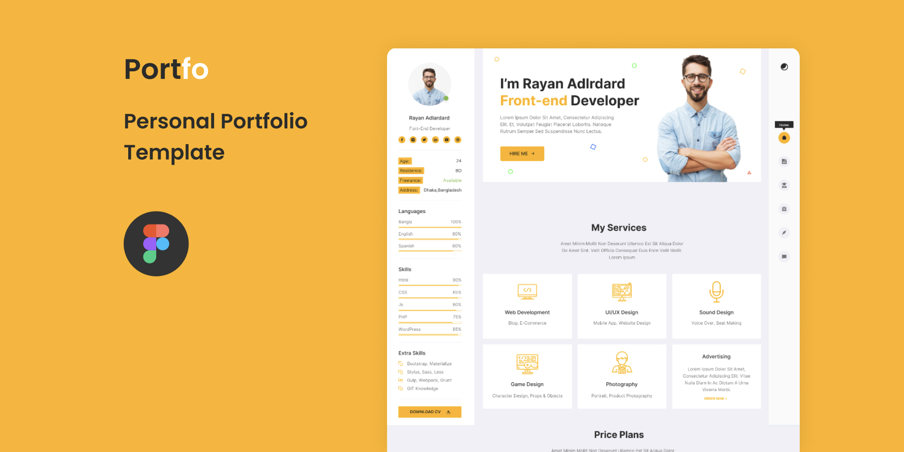

<h1 align="center">
    
</h1>

<p align="center">
  <a href="#-technologies">Technologies</a>&nbsp;&nbsp;&nbsp;|&nbsp;&nbsp;&nbsp;
  <a href="#-layout">Getting started</a>&nbsp;&nbsp;&nbsp;|&nbsp;&nbsp;&nbsp;
  <a href="#-project">Project</a>&nbsp;&nbsp;&nbsp;|&nbsp;&nbsp;&nbsp;
  <a href="#-layout">Layout</a>&nbsp;&nbsp;&nbsp;|&nbsp;&nbsp;&nbsp;
  <a href="#-license">License</a>
</p>

<p align="center">
  
  
  

  
</p>

<br>

<p align="center">
  
</p>

## 🧪 Technologies

This project was developed using the following technologies:

- [React](https://reactjs.org)
- [Styled Component](https://styled-components.com/)

## 🚀 Getting started

Clone the project and access the folder

```bash
$ git clone https://github.com/JorgeFPeres/myportifolio.git && cd myportifolio
```

Follow the steps below

```bash
# Install the dependencies
$ yarn

# Start the project
$ yarn start
```

## 💻 Project

[Portfolio](https://portfo-project-git-main-ojjomedia.vercel.app/) my portfolio, make a good use. ❤️

This is a project developed by me during April, 2021.

## 🔖 Layout

You can view the project layout through the links below:

- [Layout Web](https://www.figma.com/community/file/966954657029620690)

Remembering that you need to have a [Figma](http://figma.com/) account to access it.

## 📝 License

This project is licensed under the MIT License. See the [LICENSE](LICENSE.md) file for details.

---

<p align="center">Made with ❤️ by Jorge F Peres</p>
